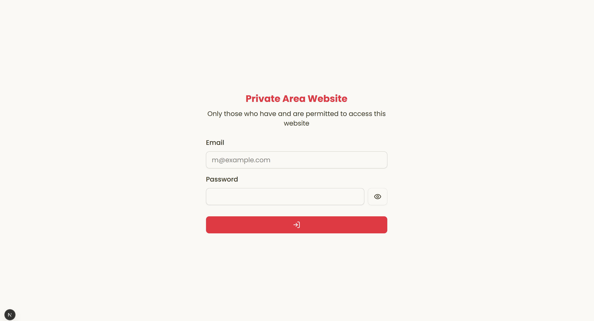
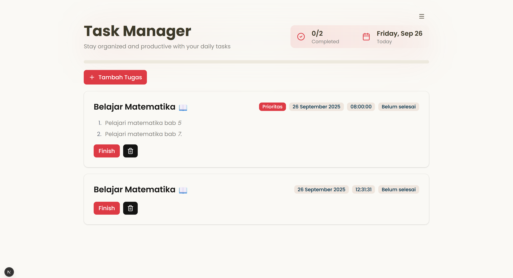

<div align="center">


## Extask, a todolist based on 

**Extask** is a todolist app based supabase

**Login Page**  

**Home Page**  

</div>

## Commit Rules

**Format :** `<type>(<scope>): <subject>`

`<scope>` _opsional_

### Contoh:

```
feat(auth): Menambahkan fitur login
^--^        ^--------------------^
|           |
|           +-> Ringkasan dalam bentuk present tense.
|
+-------> Tipe: chore, docs, feat, fix, refactor, style, or test.
```

More Examples:
| Type | Deskripsi |
|-----------|-----------------------------------------------------------------------------------------------|
| `feat` | fitur baru untuk pengguna, bukan fitur baru untuk skrip build |
| `fix` | perbaikan bug untuk pengguna, bukan perbaikan pada skrip build |
| `change` | perbuhan kode bersifat global dan umum |
| `docs` | penambahan dan perubahan dokumentasi |
| `renewal` | memperbarui fungsi kode, mempengaruhi kode produksi |
| `style` | pemformatan, titik koma hilang, dll; tidak ada perubahan kode produksi |
| `refactor`| melakukan refaktor kode produksi, misalnya mengganti nama variabel |
| `test` | menambahkan tes yang hilang, melakukan refaktor tes; tidak ada perubahan kode produksi |
| `chore` | memperbarui tugas kasar dll; tidak ada perubahan kode produksi |
| `tools` | alat development, seperti lib, framework, dll |
| |
